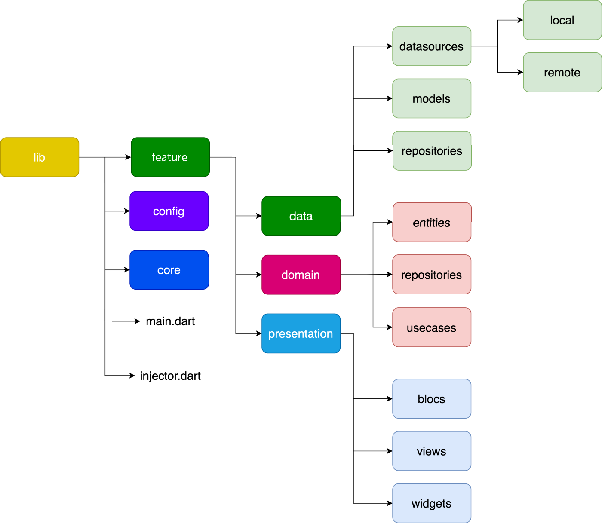

# rick_and_morty

Отображает список персонажей с сайта, предоставляющего api формата json.

Реализовано:
- динамическая подгрузка персонажей
- поиск по имени персонажа
- кэширование последних 20 персонажей

<table>
  <tr>
    <td>  </td>
        <td>
      <ul>
      <li>bloc</li>
      <li>cubit</li>
      <li>clean architecture</li>
      <li>dependency injection</li>
</ul> 
    </td> 
   </tr> 
</table>

