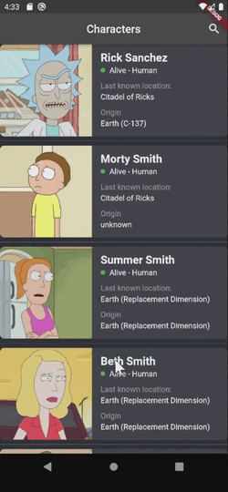

# rick_and_morty

* bloc, cubit
* clean architecture
* dependency injection

Отображает список персонажей с сайта, предоставляющего api формата json.

Реализовано:
* динамическая подгрузка персонажей
* поиск по имени персонажа
* кэширование последних 20 персонажей

